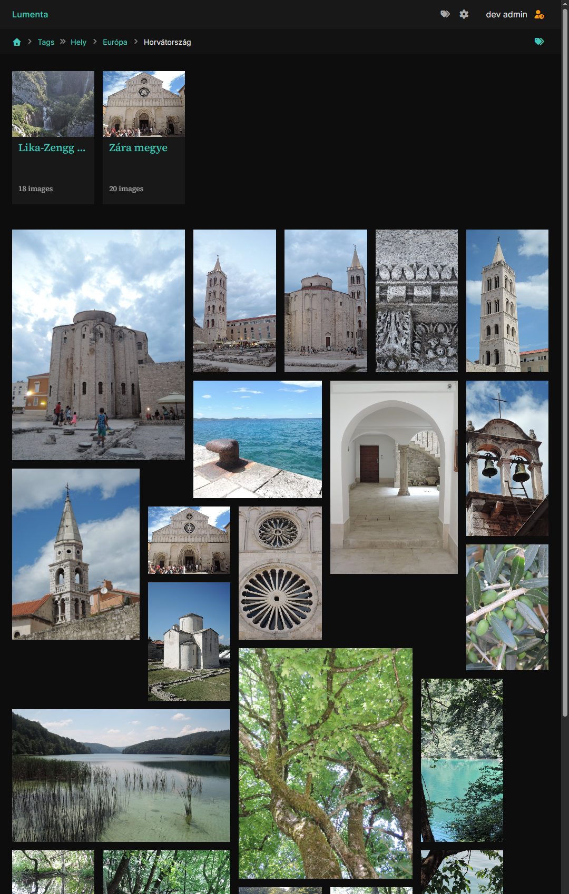
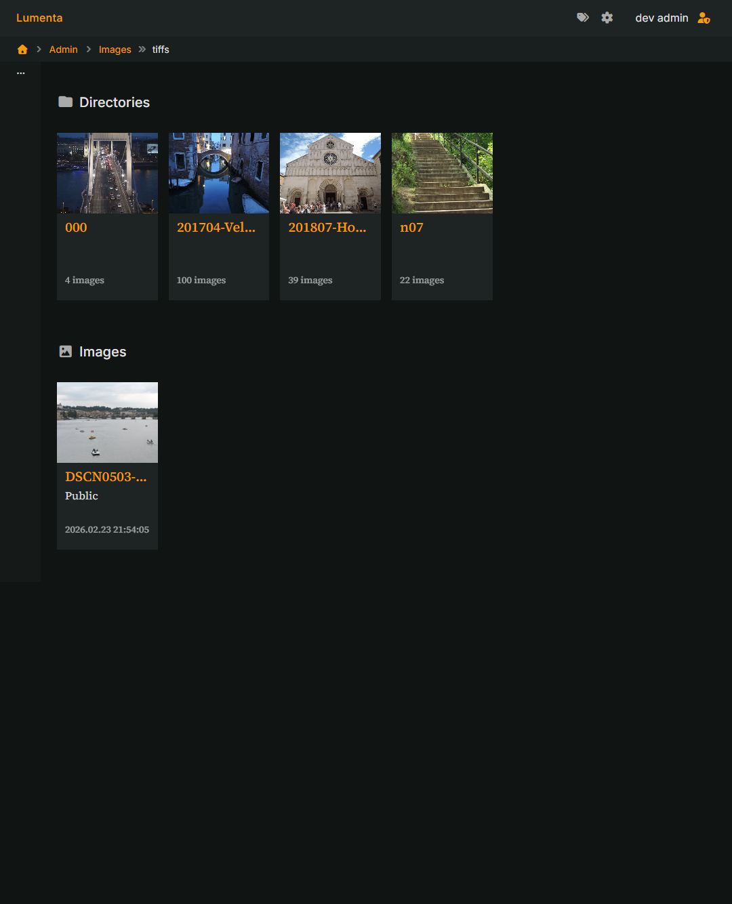

# Lumenta

**Lumenta is an automation-first, self-hosted photo library engine for photographers who think in archives, not uploads.**

It is not just a gallery.
It is a deterministic indexing core with a presentation layer on top — built around a simple promise:

> Configure it once. Feed it images. Let it organize itself.

Lumenta continuously reads your structured photo archive, evaluates rules, materializes albums, and exposes a clean web layer — without asking you to manually curate anything twice.

Designed for large collections and long-term ownership, Lumenta treats your photo library as a structured, evolving system — not a pile of files waiting to be uploaded.

For photographers, this means control.
For engineers, this means determinism.
For both, it means automation without chaos.

## Where Lumenta fits in a photographer’s workflow

Lumenta is designed to sit **after your editing and tagging workflow**.

Typical workflow:

1. Shoot
2. Import into your photo management tool (e.g. Lightroom, digiKam, etc.)
3. Rate, tag, and organize
4. Export or sync to your structured archive
5. Let **Lumenta read that archive automatically**

You do not upload photos into Lumenta.
You point it at your existing filesystem-based archive, and it builds the web presentation layer from there.

For photographers, this means:

- No duplicated upload step
- No secondary manual album maintenance
- No divergence between your editing tool and your web gallery
- Your existing hierarchical tags remain meaningful

Configure it once. Feed it images. It does the rest.

## Why Lumenta is not “just another photo album”

Lumenta is intentionally opinionated.

- **Single owner model** – this is not a multi-user upload platform.
- No collaborative image uploads.
- No group editing.
- Users exist only with different read-level access (e.g. guest, authenticated user).

The archive belongs to one photographer.
Access levels control visibility — not authorship.

## Filesystem-first design

The filesystem is the source of truth.

- Images stay where you manage them.
- No re-upload required.
- No proprietary storage layer.
- Your directory structure remains meaningful.

Lumenta scans the configured root directory and builds its internal model from that structure.

## Rule-based automation

Automation is central.

Rules are used to define:

- Which images should be indexed
- What qualifies as special formats (e.g. panorama detection)
- Planned: default ACL rules based on metadata or structure
- Album population logic

Albums are not curated manually.
They are generated deterministically from rule definitions.

The current rule model reflects the working design and may evolve while abstractions are being refined.

## Metadata and hierarchical tags

Lumenta provides a flexible, configurable metadata system.

- Metadata definitions are configurable.
- Extraction and synchronization are rule-driven.
- Hierarchical tags are supported and preserved.

Hierarchical tagging — still uncommon in many web galleries — is treated as a first-class concept.

The goal is not to re-edit metadata in the web layer, but to faithfully represent and leverage the structure already created in your photo workflow.

## Strong configuration model

The entire system is configuration-driven.

- Indexing behavior
- Rule logic
- Metadata mapping
- Album generation
- Derivative behavior
- Access defaults

The design philosophy is simple:

> Configure it once. Feed it images. Let it organize itself.

[Configration documentation](./doc/config.md)

## Presentation layer and extensibility

The web layer is template-based.

- Pages are rendered using configurable templates.
- The structure allows for future theme support.
- The goal is visual flexibility without breaking deterministic backend logic.

## Development status

This project is in **early development**.
The focus so far has been on validating core architecture, data flow, and abstractions rather than on feature completeness.

The following areas are **implemented or actively being worked on**, and should be considered usable but still evolving:

### Data ingestion and backend core

The full filesystem-to-database ingestion path is in place and under active refinement:

- Database schema and access layer, with a strong focus on the `images` domain model
- Filesystem scanning and sync pipeline
- Deterministic import using a rule engine–driven model
- Configuration loading and structured configuration validation

Together, these form the backbone of the system: the authoritative **filesystem → database** data flow.

### Web backend and presentation layer

The server-side web foundation is present and functional:

- Web server framework and request routing
- User handling and access control foundations
- Image grid rendering and basic gallery presentation

These components establish the baseline for browsing and interacting with the indexed photo collection,
while higher-level UI features and polish are expected to evolve over time.

Breaking changes are expected, and no backward compatibility guarantees are provided at this stage.

This repository should be considered experimental.

## Building

```bash
go build ./...
```
## Showcase





