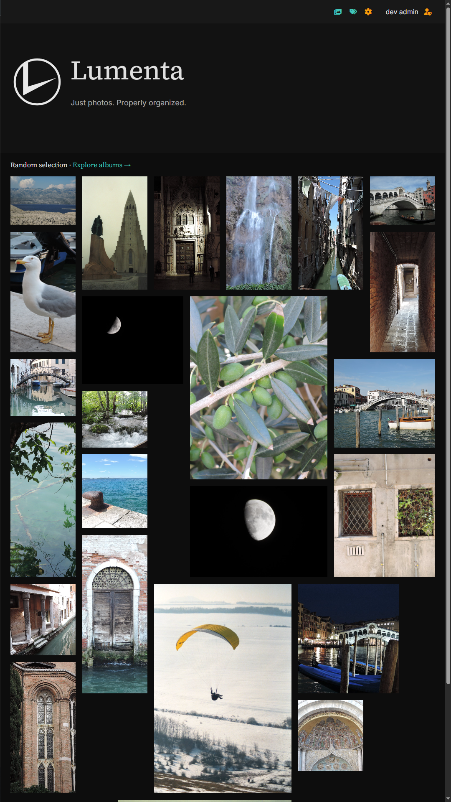
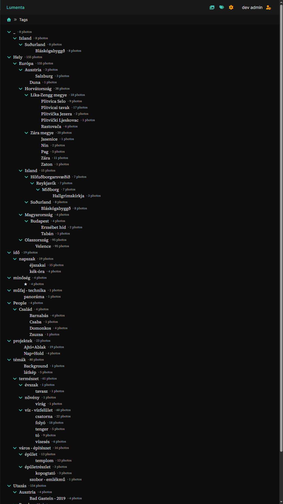
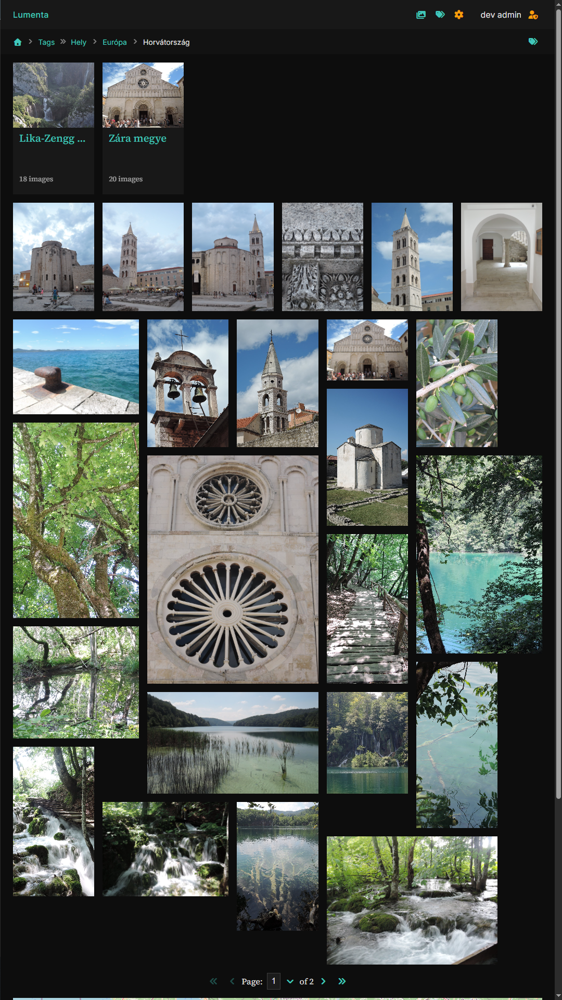
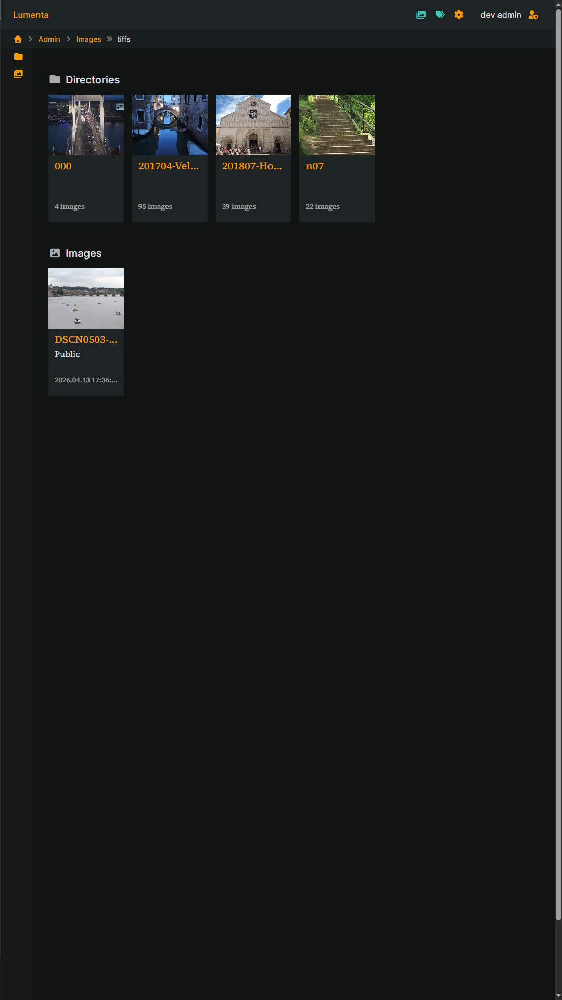
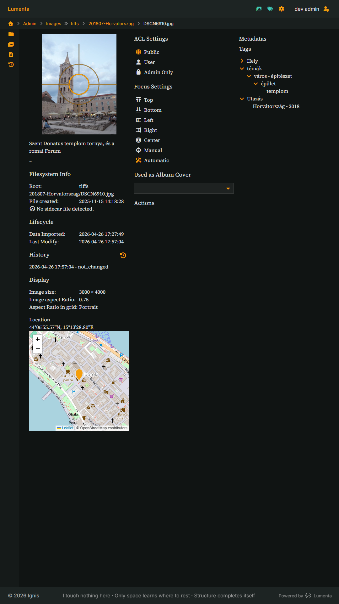

# Lumenta

**Lumenta is a rule-driven, self-hosted gallery engine for people who already manage their photos properly — and don’t want to manage them again in their gallery.**

It is not just a gallery.  
It is a structured rule system from which albums are generated automatically.

You tag once.  
You organize once.  
You define rules once.

After that, you just add images.

No manual syncing.  
No album micromanagement.  
No per-image ACL tweaking.

Lumenta reads your filesystem directly, extracts metadata, stores it in a database, and evaluates your rules to build albums automatically.  
The web layer operates exclusively from this indexed model — reflecting the structure you already created.

Designed for large photo collections, Lumenta removes repeated work and long-term maintenance overhead.

> Configure it once. Feed it images. Forget it.

Automation. Without chaos.

## Where Lumenta fits in a photographer’s workflow

Lumenta typically enters at the end of your workflow — **after editing and tagging**.

A typical process:

1. Shoot
2. Import into your photo management tool (e.g., Lightroom, digiKam, etc.)
3. Select and edit
4. Rate, tag and organize
5. Export or sync to your structured archive
6. Lumenta reads the archive automatically

There is:

- No manual upload step  
- No web-format conversion step  
- No manual import  
- No manual album maintenance  

You simply point Lumenta to your existing filesystem-based archive, and it builds the web presentation layer on top of it.

## Why Lumenta is not “just another photo album”

Lumenta follows a **single-owner model**.

This means:

- It is not a multi-user upload platform  
- There is no collaborative image uploading  
- There is no group editing  
- Users exist only with different read-level permissions (e.g., guest, authenticated user)

The archive belongs to one photographer.  
Access levels control visibility — not authorship.

## Filesystem-first design

The filesystem is the source of truth.

- Images remain where you manage them  
- No re-upload required  
- No proprietary storage layer  
- Your directory structure retains its meaning  

Lumenta scans the configured root directory and builds its internal model from that structure.
The system is designed around large, continuously growing filesystem-based photo archives.

## Rule-based automation

Rules and automation are central.

Rules define:

- Which images are indexed (and which are excluded)
- What qualifies as special formats (e.g., panorama detection)
- Default ACL (Access Control List) behavior based on metadata or structure
- Album population logic

Albums are not curated manually.  
They are generated deterministically from rule definitions.

## Metadata and hierarchical tags

Lumenta provides a flexible and configurable metadata system.

- Metadata definitions are configurable
- Most rule definitions are built on top of metadata
- Hierarchical tags are fully supported

Hierarchical tagging — still uncommon in many web galleries — is treated as a first-class concept.

The goal is not to re-edit metadata in the web layer, but to faithfully represent and leverage the structure already created in your photo workflow.

Both embedded metadata and sidecar files are supported, with a clear hierarchy between sources when resolving conflicts.

## Strong configuration model

The entire system is built on a powerful configuration layer.

- Indexing behavior
- Rule logic
- Metadata mapping
- Album generation
- Derivative handling
- Default access rules
- Branding
- Theme support

[Configuration documentation](./doc/config.md)

## Presentation layer and extensibility

The web layer is template-based.

- Pages are rendered using configurable templates
- The structure allows future theme support
- The goal is visual flexibility without compromising backend determinism

## Design story

Why Lumenta exists, what problems led to it,
and how its architecture evolved from real-world workflow limitations:

[From Piwigo to Lumenta](./doc/design-story.md)

## Development status

This project is in **early development**.  
The focus so far has been on validating the core architecture, data flow, and abstractions rather than on feature completeness.

The following areas are implemented or actively being refined and are usable, though still evolving:

### Data ingestion and backend core

The complete filesystem → database ingestion pipeline is implemented and operational.

Implemented features include:

- Database schema and access layer centered around the `images` domain model
- Concurrent filesystem scanning and synchronization pipeline
- Deterministic rule-driven import and filtering
- Metadata-based indexing and hierarchical tag support
- Rule evaluation tracing and debug logging for full decision transparency
- Structured configuration loading and validation
- Incremental synchronization with change detection and metadata reuse

The ingestion system is designed for large real-world archives, including mixed JPG/TIFF workloads stored on NAS systems.

Together, these components form the backbone of the system: the authoritative **filesystem → database** data flow.

### Web backend and presentation layer

The server-side web foundation is functional:

- Web framework and routing
- User handling and access control foundations
- Image grid rendering and basic gallery presentation
- Tag tree rendering
- Tag browser page
- Generic image page with openable info panel, fullscreen capatible and slideshow
- Map (leaflet) integration for single image
- Internationalization (i18n) support with structured translation keys

Admin interface:

- Image browser with detailed metadata and filesystem information
- Album editor with rule-based configuration
- Sync run and file-level logging views
- Rule evaluation debug and tracing interface

These components provide the foundation for browsing and interacting with the indexed collection, while higher-level UI features and refinements will evolve over time.

## Performance (typical photography setup)

### Remote NAS benchmark

Dataset:

- 18,515 × ~5 MB JPG with minimal metadata
- 1,536 × ~5 MB JPG with EXIF + hierarchical tags
- 5,145 × ~10–30 MB TIFF with extensive metadata
- 4,063 × ~5 MB TIFF with metadata
- total dataset size: ~320 GB

Configuration:

- 2 hash workers
- 8 metadata workers
- 1 downstream pipeline workers

Results:

- cold ingest (empty database): ~41 minutes
- cached sync (database already populated): ~37 minutes
- ~29,000 images scanned
- ~16,000 filtered out during import based on metadata
- ~13,000 inserted into database

Environment:

- Intel i7 workstation
- 32 GB RAM
- normal desktop/workstation usage during measurements
- ~75% overall system memory usage during measurements
- images stored on NAS (network storage)
- MariaDB running remotely
- 8 metadata workers
- 2 hash workers

Notes:

- Filtering depends on metadata evaluation, so files must still be opened and inspected
- Large TIFF workloads are primarily limited by filesystem and network IO throughput
- Metadata reuse significantly reduces metadata processing overhead on repeated runs
- Increasing hash worker concurrency beyond this point no longer improved throughput, indicating that the current bottleneck is NAS throughput
- The measured workload operates close to the practical throughput limit of the ~100 MB/s network/storage setup
- The concurrent ingestion pipeline remained stable throughout the measured runs
- Measurements were performed in a non-isolated real-world workstation environment

### Local SSD benchmark (subset of the original dataset)

A subset of the original benchmark dataset was copied from NAS to local SSD storage while keeping the MariaDB server remote.

Dataset:

- ~10,000 images
- mixed JPG/TIFF workload
- ~160 GB total data

Configuration:

- aggressively increased worker concurrency
- 16 hash workers
- 32 metadata and downstream pipeline workers

Results:

- cold ingest (empty database): ~4m 25s
- ~620 MB/s effective cold ingest throughput
- cached sync (database already populated): ~2m 33s
- ~1.0–1.1 GB/s effective cached ingest throughput

Notes:

- Local SSD storage significantly reduced ingest time compared to the NAS-based benchmark
- Cached synchronization removed most metadata processing overhead
- The ingestion pipeline remained stable under very high worker concurrency

## Showcase

### Main page


### Public hierarchical tag tree


### Public hierarchical tag browser


### Public generic image page


### Admin filesystem browser


### Admin image details page


More image int the [Ui section](doc/_ui.md)

## Build

```bash
go build ./...
```

This repository should be considered experimental.