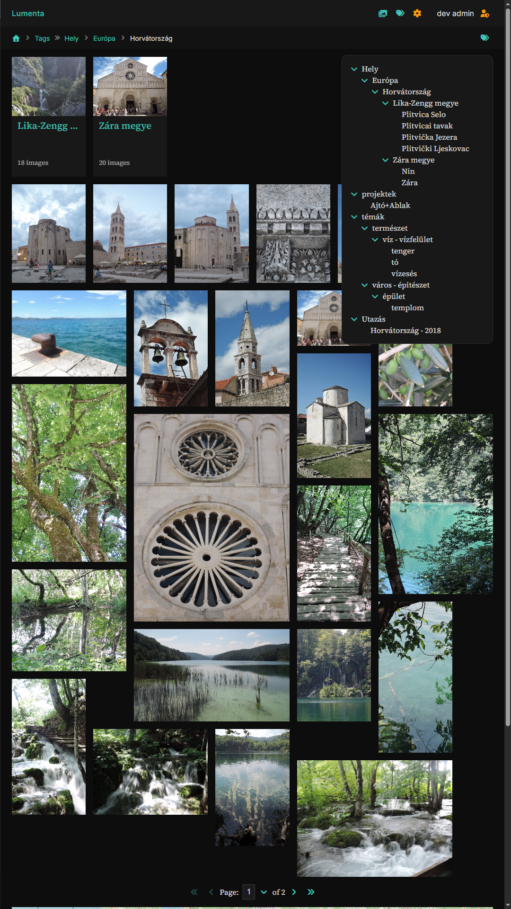
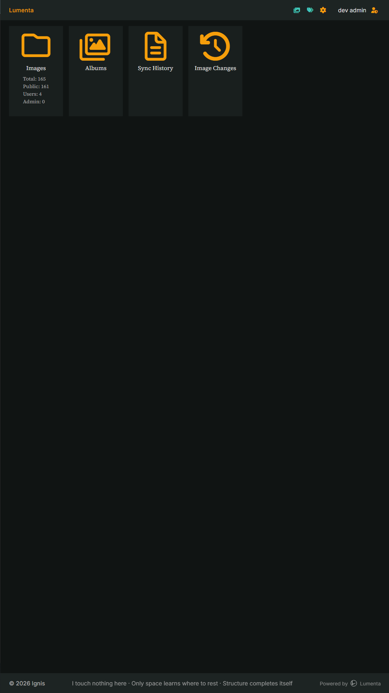
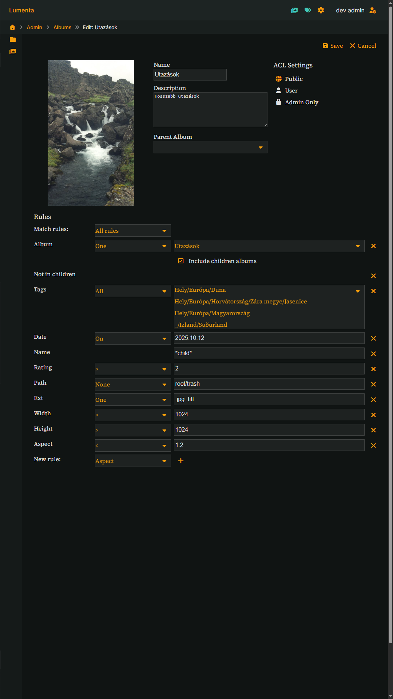
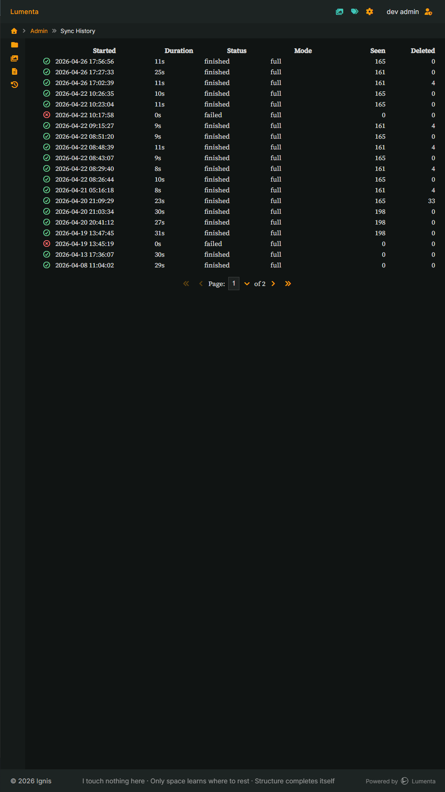
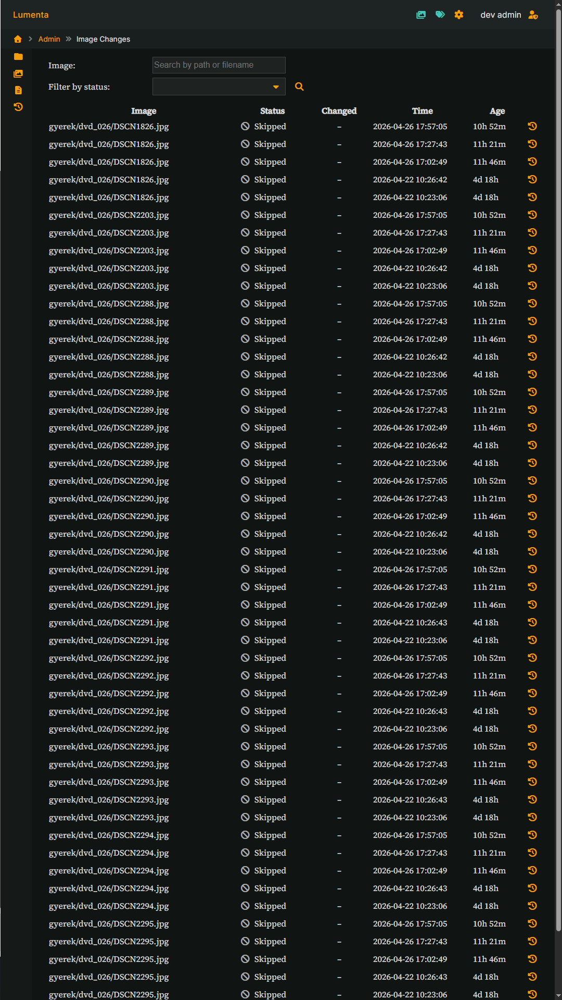
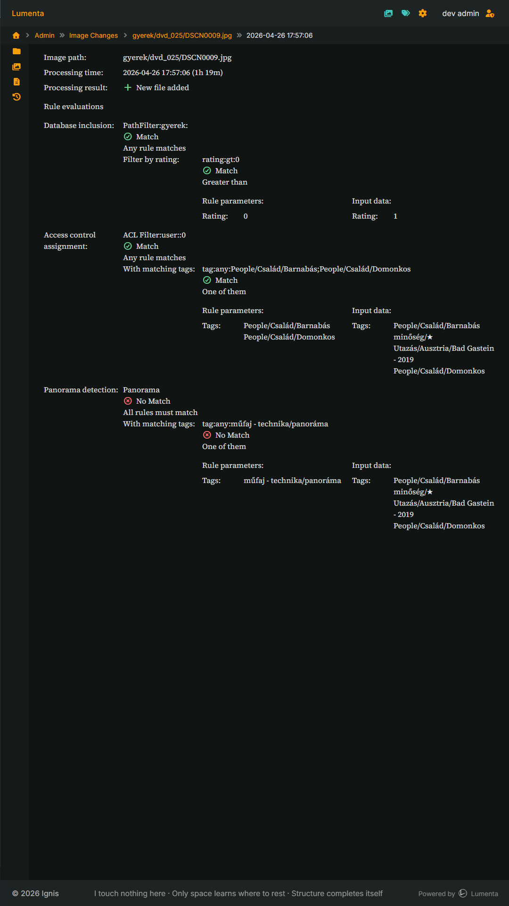

# User Interface

This page documents the current UI screens and shared interface elements.
Structure may change as the interface evolves.

## Shared UI elements
### Header

- Brand (Lumenta logo)
- Navigation icons (browse, tags, admin)
- User indicator (username / role)
- Admin access

**Notes:**
- Always visible
- Icons represent global navigation/actions

### Breadcrumbs

- Shows current navigation context
- Clickable path segments
- Represents logical navigation (albums, tags, views), not raw filesystem paths.

### Context menu

- Attached to breadcrumb elements or page context
- Provides context-specific actions (e.g. open admin, edit, inspect)

### Layout

- Header
- Breadcrumbs
- Main content area
- Optional side/info panels

## Screens

### Access and navigation model

- Image visibility is determined solely by each image's ACL
- Navigation structures (albums, tags, random views) do not restrict access

- An image that is not reachable through one path (e.g. a restricted album)
  may still be accessible through other paths, such as:
  - tag navigation
  - random selection
  - direct access

> [!IMPORTANT]
> Navigation does not imply access control.
> Placing public images into a restricted album does not make them private.

### Public

User-facing interface for browsing and exploring images.

#### Landing page

**Purpose:**  
Entry point of the application, showcasing a random selection of images.

**Main components:**
- Header (shared)
- Random image grid
- "Explore albums" entry point
- User / login indicator

**Behavior:**
- Displays 24 random images
- Clicking an image opens the image page
- "Explore albums" navigates to album browsing

**Notes:**
- Masonry-like layout (mixed aspect ratios)
- Content-focused, minimal UI

#### Tag browser

**Purpose:**  
Browse the image collection through a hierarchical tag structure.

**Main components:**
- Multi-level tag tree
- Expand/collapse controls
- Image count per tag
- Navigation via tag selection

**Behavior:**
- Tags can be expanded and collapsed
- Clicking a tag navigates to images associated with that tag
- Parent tags include images from their child tags

**Visibility model:**

- The displayed tag tree is **not the full global tag hierarchy**
- It is dynamically built from **images visible to the current user**
- Tag counts reflect only **visible images**
- Tags with zero visible images are **not shown**

**Notes:**
- Tags are hierarchical and reflect the underlying metadata structure
- Tag data is read-only (imported from external sources, e.g. Digikam)
- The UI always presents a **non-empty, navigable subset** of the tag tree

#### Collection view (folders + images)

**Purpose:**  
Browse a hierarchical collection (tags or albums) and view the images within the current context.

**Main components:**

- Breadcrumbs (current path)
- Sub-collections (child folders) with pagination controls
- Image grid
- Pagination controls
- Map view (bottom section)

**Layout:**

- Top: sub-collections (child tags or albums)
- Below: pagination for sub-collections (if multiple pages)
- Middle: image grid
- Below: pagination for images (if multiple pages)
- Bottom: map showing image locations

**Behavior:**

- Sub-collections and images are paginated independently
- Pagination controls are shown only when more than one page is available
- Folder pagination affects only the sub-collection list
- Image pagination affects only the image grid
- The map represents all images in the current collection, independent of pagination

**Collection model:**

- The same interface is used for:
  - Tag-based navigation
  - Album-based navigation

- Collections behave like folders, but are not filesystem directories:
  - Tags represent a metadata hierarchy
  - Albums are defined by rules

**Visibility model:**

**Tags:**
- Tags are shown only if they contain at least one visible image
- Tag counts reflect only user-visible images
- Tags with zero visible images are not displayed

**Albums:**
- Albums are visible based on their own ACL, independent of their contents
- An album may be visible even if it currently contains no visible images
- Image counts within albums reflect only user-visible images

**Map:**
- Includes only user-visible images from the current collection

**Contextual tag tree:**

- A filtered tag hierarchy is available from the context menu
- The tree is built from images within the current collection
- Only tags associated with the current result set are shown
- Tag counts reflect images within the current collection (not limited to the current page)

**Behavior:**

- Accessible via the context menu
- Allows navigation within the current collection using tag hierarchy
- Does not expose the global tag tree

**Design note:**

- Provides an alternative navigation layer based on content, not structure

#### Image page

**Purpose:**  
Display a single image as the primary viewing unit, with navigation and contextual information.

**Main components:**

- Image viewport (main content)
- Navigation overlay (previous / next)
- Back navigation (top overlay)
- Thumbnail strip (current collection)
- Info panel (toggleable)

**Layout:**

- Center: main image
- Overlay:
  - Left / right: navigation controls
  - Top: back navigation
- Bottom: thumbnail strip (if a collection context exists)
- Side: info panel (when opened)

**Behavior:**

- Clicking navigation arrows moves within the current collection
- Back control returns to the previous collection view
- Thumbnail strip allows direct navigation within the collection
- If no collection context is available, navigation is limited or disabled
- The current image is always the primary focus
- Admin users can navigate to the image administration page via the header controls
- The admin link exposes the underlying system state behind the image

**Collection context:**

- The image page may be opened within a collection (tag or album)
- In this case:
  - Navigation operates within that collection
  - Thumbnails reflect the current collection
- Without a collection context:
  - The image is shown as a standalone item

**Notes:**

- This is the canonical view for all public images
- All images are accessed through this page

### Admin

Administrative interface for inspecting and managing the system.

**Design note:**
Uses a distinct color palette to differentiate system-level views from public browsing.

#### Admin home

**Purpose:**  
Provide an entry point to administrative functions and system views.

**Main components:**

- Navigation cards:
  - Images
  - Albums
  - Sync history
  - Image changes

- Summary information (e.g. image counts grouped by visibility)
    - Image counts are grouped by visibility levels (public, user, admin)

**Behavior:**

- Each card navigates to a dedicated admin section
- Summary values reflect the current system state
- Available options depend on user permissions

**Notes:**

- This page is a lightweight navigation hub rather than a full analytics dashboard
- Additional metrics and controls may be added in the future

**Design note:**

- The dashboard intentionally avoids complexity and focuses on direct access to system areas

#### Image browser (filesystem view)

**Purpose:**  
Browse imported images using their original filesystem structure.

**Main components:**

- Directory list (grouped by root and path)
- Image list within the selected directory
- Image metadata summary (e.g. visibility, timestamps)

**Behavior:**

- Directories represent logical groupings based on original file paths
- Clicking a directory navigates deeper into the hierarchy
- Clicking an image opens the admin image page
- Only imported images are shown

**Filesystem model:**

- This is not a live filesystem browser
- The view is generated from the database

- Each image is identified by:
  - root
  - relative path
  - filename

- The structure reflects the original filesystem layout at import time

**Important:**

- Only images that have been imported are visible
- The UI does not access or modify the filesystem directly
- This is a database-backed representation of the filesystem

**Notes:**

- This view is primarily intended for inspection and debugging
- It provides a stable reference independent of tag or album structure

#### Image page

**Purpose:**  
Provide a detailed, system-level view of an image, including its filesystem state, metadata, access control, and processing lifecycle.

**Main components:**

- Image preview (with focus controls)
- ACL settings
- Metadata and tag hierarchy
- Filesystem information
- Lifecycle and sync history
- Display properties
- Location map
- Actions (e.g. album cover assignment)

**Layout:**

- Left: image preview and basic description
- Center: system controls (ACL, focus, actions)
- Right: metadata and tag hierarchy
- Bottom: extended information (filesystem, lifecycle, display, map)

**Behavior:**

- ACL settings control visibility of the image across the system
- Focus settings influence how the image is displayed in grids
    - Focus represents the part of the image that should remain visible in constrained layouts
- Tags are read-only and reflect imported metadata
- The map shows the stored location of the image
- History shows the latest sync-related events

**Filesystem model:**

- Each image is identified by:
  - root
  - relative path
  - filename

- Filesystem data is not modified by the UI
- Sidecar files (if present) are detected and displayed

**Lifecycle model:**

- Images are processed through sync runs
- Stored timestamps include:
  - data import time
  - last modification time

- History entries reflect sync decisions (e.g. `not_changed`, `updated`, `filtered_out`)
- The history icon provides access to deeper sync diagnostics

**Metadata model:**

- Metadata is extracted during sync and stored in the database, not read live from the file
- Tag hierarchy reflects imported external metadata
- Metadata and tags are not editable from this interface
- All values are derived from the last sync and treated as read-only

**Visibility (ACL):**

- Visibility is controlled independently from tags and albums
- The image may be:
  - public
  - user-restricted
    - visible to any authenticated user
    - or restricted to a specific user
  - admin-only

**Notes:**

- Focus is a presentation concept, not a photographic property
- This page exposes the internal system state behind an image
- It is primarily intended for inspection and debugging

#### Albums

🚧 **Work in progress**

Albums are a core concept in Lumenta, defined by rules rather than manual image assignment.
The UI for browsing and managing albums is currently under development.

This section will document:

- Album list and navigation
- Rule-based album definitions
- Album hierarchy
- Interaction with the collection view

#### Album editor

**Purpose:**  
Define and manage albums using rule-based image selection.

**Main components:**

- Album metadata:
  - Name
  - Description
  - Parent album
- ACL settings
- Rule editor (core component)

**Rule model:**

- Albums are defined by rules, not by manually selecting images
- Rules determine which images belong to the album during sync
- Multiple rules can be combined using logical operators (e.g. match all / any)

**Rule editor:**

- Rules define conditions based on different aspects of an image, for example:

  - Metadata (e.g. tags, date)
  - Filesystem attributes (e.g. path, name, extension)
  - Image properties (e.g. dimensions, aspect ratio)
  - Relationships to other albums

- The examples above are illustrative, not exhaustive
- The rule system is described in detail in the dedicated rules documentation

**Behavior:**

- Changes affect album contents after the next sync or evaluation
- The UI defines the rules, but does not directly assign images
- Parent album defines hierarchy only, not content inheritance

**Album model:**

- Albums are independent entities with their own ACL
- Album visibility is not derived from their contents
- Image visibility within an album is determined by each image's own ACL, not by the album
- Albums may exist without matching images
- Albums may appear empty either because they contain no images, or because none of their images are visible to the current user

**Cover / representation:**

- Album cover (hero image) is not selected here
- It is assigned from the image administration interface

**Design note:**

- Cover selection is image-driven rather than album-driven,
  avoiding the need to browse large image sets within the album editor

#### Sync runs

**Purpose:**  
Provide an overview of synchronization runs and their outcomes.

**Main components:**
- List of sync runs with:
  - Start time
  - Duration
  - Status (finished, failed)
  - Mode (e.g. full)
  - Processed image counts (seen, deleted)

- Pagination controls

**Behavior:**

- Each row represents a completed or failed sync run
- Status indicates the overall result of the run
- Duration reflects total processing time
- Counts summarize the effect of the run on the dataset

- Clicking a run opens the detailed sync view for that run

**Sync model:**

- A sync run represents a full evaluation of the system state
- It includes:
  - filesystem scanning
  - metadata extraction
  - rule evaluation
  - database updates

- Each run produces a consistent snapshot of decisions

**Notes:**

- Failed runs may have partial or no results
- Runs are immutable once completed
- Sync runs are one entry point into deeper inspection (file-level and rule-level details)

#### Image changes (file-based view)

**Purpose:**  
Inspect synchronization events at the file (image) level.

**Main components:**

- Event list with:
  - Image identifier (path / filename)
  - Status (e.g. updated, skipped, error)
  - Change indicator
  - Timestamp
  - Relative age
- Optional controls:
  - Search by path or filename
  - Filter by status
- Row actions (context-dependent)

**Behavior:**

- Each row represents a single sync event for an image
- Rows are clickable and open the detailed event view
- Status reflects the decision made during the sync process

**Views:**

This interface is used in three different contexts:

- **From a sync run (run-based view):**
  - Shows events belonging to a specific sync run
  - Supports filtering by status
  - Row action allows navigation to the full history of the selected image

- **Global event list (file-based entry point):**
  - Shows all recorded events across runs
  - Supports search (path / filename) and status filtering
  - Provides access to image-level history

- **Single image history:**
  - Shows the full timeline of a specific image
  - No filtering or row actions
  - Focused on chronological inspection

**Navigation model:**

- From sync runs → to file events
- From file events → to image-level history
- From any event → to detailed event view

This creates a continuous inspection path from system-level runs to individual rule evaluations

**Event model:**

- Each sync decision is recorded as an event
- Events form a timeline per image
- The same data can be explored from:
  - a run perspective
  - a file (image) perspective

#### Event detail (rule evaluation)

**Purpose:**  
Provide a detailed view of a single sync event, including rule evaluation and decision-making.

**Main components:**

- Event metadata:
  - Image path
  - Processing time
  - Processing result (e.g. new file, updated, skipped)

- Rule evaluation sections:
  - Database inclusion
  - Access control assignment
  - Additional classifications (e.g. panorama detection)

- For each rule:
  - Result (match / no match)
  - Logical grouping (e.g. any / all)
  - Rule parameters
  - Input data used for evaluation

**Behavior:**

- Each section represents a distinct decision stage in the pipeline
- Rules are evaluated against the image's metadata snapshot at processing time
- Results are shown per group and per rule
- The pipeline is sequential; earlier decisions influence later ones
- If an image is excluded at an earlier stage, subsequent rule evaluations may be skipped

**Rule model:**

- Rules operate on input data extracted during sync
- Each rule produces a result (match / no match / unknown)
- Grouped rules determine the final decision for each stage
- Rules may produce an `unknown` result when evaluation is not possible
  (e.g. certain album-based conditions)
- In aggregated evaluation:
  - `unknown` is treated as a non-matching result
  - it may cause the overall rule group to fail

**Debug model:**

- This view exposes the internal decision process of the system
- It allows tracing:
  - why an image was included or excluded
  - how ACL was assigned
  - how classifications were determined

**Notes:**

- Rule parameters represent the configured conditions
- Input data represents the actual values used during evaluation
- Differences between them explain the outcome of each rule